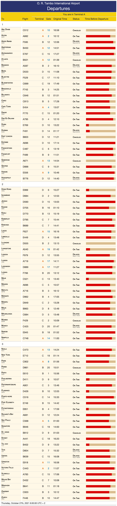

<!-- README.md is generated from README.Rmd. Please edit that file -->

```{r, include = FALSE}
knitr::opts_chunk$set(
  collapse = TRUE,
  comment = "#>"
)
library(emo)
```

# Around the World in a Single Table `r emo::ji("balloon")`
## 2021-10-27 R-Ladies Johannesburg Presentation

I will be discussing tables as a format for communicating information and walking through creating a table in R using the {gt} package.

`r emo::ji("calendar")` [Event Page](https://www.meetup.com/rladies-johannesburg/events/281522272/)

`r emo::ji("memo")` [Presentation](https://ivelasq.github.io/2021-10-27_rladies-jozi-presentation/slides.html) (DRAFT)

`r emo::ji("computer")` [RStudio Cloud (requires login)](https://rstudio.cloud/project/3093601)

`r emo::ji("world")` [Final Table](https://ivelasq.github.io/2021-10-27_rladies-jozi-presentation/tab/final_tab.html)

`r emo::ji("link")` Links mentioned in talk:

* [Isabella's Twitter](https://twitter.com/ivelasq3)
* [2021 RStudio Table Contest](https://blog.rstudio.com/2021/09/30/rstudio-table-contest-2021/)
* [Ryan Estrellado's website](https://ryanestrellado.com/)
* [Visual Thinking Graphic Discoveries by Michael Friendly](https://medium.com/@michael.friendly/visual-thinking-graphic-discoveries-128468677592)
* [Francisco Requena's tutorial on Exploring World Airline Network](https://franciscorequena.com/post/exploring-world-airline-network/)

`r emo::ji("megaphone")` More on gt:

* [Package website](https://gt.rstudio.com/index.html)
* [More on tab_style](https://gt.rstudio.com/reference/tab_style.html)
* [ALL the table options!](https://gt.rstudio.com/reference/tab_options.html)
* [GT Cookbook by Thomas Mock](https://themockup.blog/static/gt-cookbook.html#Introduction)
* [Advanced Usage by Thomas Mock]( https://themockup.blog/static/gt-cookbook-advanced.html)
* [Beautiful tables in R: gt and the grammar of tables]( https://themockup.blog/static/slides/intro-tables.html#1)
* [gtExtra](https://jthomasmock.github.io/gtExtras/)
* [gtsummary](https://cran.r-project.org/web/packages/gtsummary/vignettes/rmarkdown.html)



