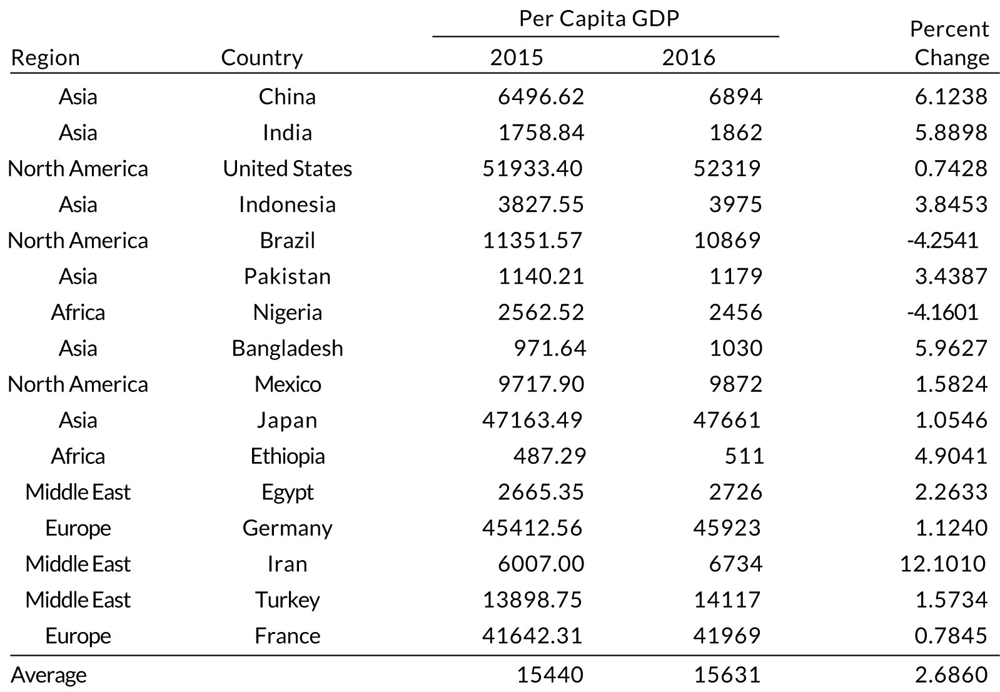

```{r setup, include = FALSE}
library(knitr)
library(tidyverse)
library(xaringanExtra)
library(tweetrmd)

# set default options
opts_chunk$set(fig.width = 7.252,
               fig.height = 4,
               dpi = 300)
xaringanExtra::use_panelset()
xaringanExtra::use_tile_view()
```

```{r metathis, echo=FALSE}
library(metathis)
meta() %>%
  meta_name("github-repo" = "ivelasq/") %>% 
  meta_social(
    title = "Around the World in a Single Table",
    description = paste(
      "Slides for R-Ladies Johannesburg Presentation"
    ),
    url = "https://github.com/kdillmcfarland/2021-04-02-r-ladies-seattle-online/",
    og_type = "website",
    og_author = "Isabella Velásquez",
    twitter_card_type = "summary_large_image",
    twitter_creator = "@ivelasq3",
    twitter_site = "@ivelasq3"
  )
```

class: title-slide, left, bottom, inverse
background-image: url(img/cover.jpg)
background-size: cover

.pull-left[
# `r rmarkdown::metadata$title`
### `r rmarkdown::metadata$author`
### `r rmarkdown::metadata$institute`
### `r rmarkdown::metadata$date`
]

.palegrey[.right[.footnote[Photo by <a href="https://unsplash.com/@m_xthree?utm_source=unsplash&utm_medium=referral&utm_content=creditCopyText">Maximilian Meyer</a> on <a href="https://unsplash.com/s/photos/hot-air-balloon?utm_source=unsplash&utm_medium=referral&utm_content=creditCopyText">Unsplash</a>]]]
---

# About Me

### Isabella Velásquez
* Sr. Product Marketing Manager, RStudio
* Website: ivelasq.rbind.io
* Twitter: @ivelasq3
* Github: @ivelasq
* LinkedIn: @ivelasq

.pull-right[

]

---
class: inverse

# Agenda

.pull-left-narrow[.center[
]]
.pull-right-wide[### Introduce tables]
--
.pull-left-narrow[.center[
]]
.pull-right-wide[### Table principles]
--
.pull-left-narrow[.center[
]]
.pull-right-wide[### The {gt} package

* RStudio Cloud Project: https://bit.ly/joziproject
* Github repo: https://bit.ly/jozirepo]

---
class: middle, center, inverse
background-color: #B38069

# Where are you joining from?


---

# 2021 RStudio Table Contest

**Closing date: November 15th**

https://blog.rstudio.com/2021/09/30/rstudio-table-contest-2021/


---
class: center
# What is a table?

--


.palegrey[.left[.footnote[Photo: Wikipedia]]]

---
# Examples of tables

.panelset[
.panel[.panel-name[Spreadsheet]

<center></center>

.palegrey[.right[.footnote[Photo: Wikipedia]]]
]

.panel[.panel-name[Relational Table]

<center></center>

.palegrey[.right[.footnote[Photo: Wikipedia]]]
]

.panel[.panel-name[Console Table]

```{r, eval = FALSE}
# install.packages("remotes")
# remotes::install_github("gvelasq/tidytab")
library(tidytab)

mtcars %>% tab(cyl)
```
```
##         cyl │      Freq.     Percent        Cum. 
## ────────────┼───────────────────────────────────
##           4 │         11        34.4        34.4 
##           6 │          7        21.9        56.3 
##           8 │         14        43.8       100.0 
## ────────────┼───────────────────────────────────
##       Total │         32       100.0           
```

.palegrey[.right[.footnote[Source: tidytab, @gvelasq]]]
]
]

---
class: center

# How is a table like a table?

--

.panelset[
.panel[.panel-name[Table 1]


]

.panel[.panel-name[Table 2]

]

.panel[.panel-name[Table 3]

]
]

.palegrey[.right[.footnote[Photo: Wikipedia]]]

---
# Table visualization

.palegrey[.footnote[Source: R for the Rest of Us]]

---
class: title, center, inverse

# Imagine...


---
background-image: url(img/airport.jpg)
background-size: cover

.palegrey[.footnote[Source: Photo by <a href="https://unsplash.com/@chuttersnap?utm_source=unsplash&utm_medium=referral&utm_content=creditCopyText">CHUTTERSNAP</a> on <a href="https://unsplash.com/s/photos/airport-security?utm_source=unsplash&utm_medium=referral&utm_content=creditCopyText">Unsplash</a>]]

---

---
class:center


---


---
class: middle, center, inverse
background-color: #B38069

# Have you ever displayed a table rather than a chart? Let us know in the chat!

---

.palegrey[.left[.footnote[Photos: Wikipedia]]]

.pull-left[

# Charts

.left[


* Abstraction
* Trends
* Distributions

]
]

--

.pull-right[

# Tables

.left[


* Specific information
* Exact comparison
* Qualitative data
* Multiple dimensions

]
]

---
class: middle

.pull-left[
```{r, echo=FALSE}
tweet_embed("https://twitter.com/ijeamaka_a/status/1420126677091323906")
```
]

.pull-right[
## Questions to consider

* Are you looking for patterns or finding precise values?
* Will you be comparing two sets of values?
* How many dimensions does your data have?
* How much time will readers have to review?
* Do you want readers to be able to search and filter for exact values?
* Will you be showing qualitative data?
]

---
background-image: url(img/airport.jpg)
background-size: cover

.palegrey[.footnote[Source: Photo by <a href="https://unsplash.com/@chuttersnap?utm_source=unsplash&utm_medium=referral&utm_content=creditCopyText">CHUTTERSNAP</a> on <a href="https://unsplash.com/s/photos/airport-security?utm_source=unsplash&utm_medium=referral&utm_content=creditCopyText">Unsplash</a>]]

---
class: inverse, center, middle


---
# Tables and charts combined

.panelset[
.panel[.panel-name[Example 1]


.palegrey[.right[.footnote[Source: Daniel Sjoberg]]]
]

.panel[.panel-name[Example 2]

<center></center>


.palegrey[.right[.footnote[Source: NYTimes]]]
]

.panel[.panel-name[Example 3]

<center></center>

.palegrey[.right[.footnote[Source: Edward Tufte]]]
]
]

---
class: center
# In conclusion

“I saw in a dream, a table, where all the elements fell into place as required. Awakening, I immediately wrote it down on a piece of paper.”


.footnote[Photo: Wikipedia]

---
class: middle, center, inverse
background-color: #B38069

# Do you have any favorite tables? Share in the chat!

---

class: center, inverse, middle

# What makes a good table?

---
# Guidelines to consider

.pull-left[

1. Offset the Heads from the Body
2. Use Subtle Dividers Rather Than Heavy Gridlines
3. Right-Align Numbers and Heads
4. Left-Align Text and Heads
5. Select the Appropriate Level of Precision
6. Guide Your Reader with Space between Rows and Columns
7. Remove Unit Repetition
8. Highlight Outliers
9. Group Similar Data and Increase White Space
10. Add Visualizations When Appropriate

]

.pull-right[
```{r, echo=FALSE}
tweet_embed("https://twitter.com/jschwabish/status/1290323581881266177")
```

]

---
class: center
.footnote[Source: Jon Schwabish]

.panelset[
.panel[.panel-name[1]

## Offset the Heads from the Body

.pull-left[

]

.pull-right[

]

]

.panel[.panel-name[2]

## Use Subtle Dividers Rather Than Heavy Gridlines

.pull-left[

]

.pull-right[

]

]

.panel[.panel-name[3]

## Right-Align Numbers and Heads


]

.panel[.panel-name[4]

## Left-Align Text and Heads


]

.panel[.panel-name[5]

## Select the Appropriate Level of Precision


]

.panel[.panel-name[6]

## Guide Your Reader with Space between Rows and Columns

.pull-left[

]

.pull-right[

]

]

.panel[.panel-name[7]

## Remove Unit Repetition

.pull-left[

]

.pull-right[

]

]

.panel[.panel-name[8]

## Highlight Outliers

.pull-left[

]

.pull-right[

]

]

.panel[.panel-name[9]

## Group Similar Data and Increase White Space

.pull-left[

]

.pull-right[

]

]

.panel[.panel-name[10]

## Add Visualizations When Appropriate


]
]

---
class: middle, center, inverse
background-color: #B38069

# Do you have any table guidelines you like to use?

---
class: center

# Learn from what you like


.footnote[Source: Niels van der Velden]

---
class: middle, center, inverse
background-color: #B38069

# What sort of information do you think is most important to display on a flight departure table?

---

# Tables in R

|             |               |                |
|-------------|---------------|----------------|
| apaTables   | pixiedust     | modelsummary   |
| DT          | reactable     | fixest::etable |
| flextable   | rhandsontable | mmtable2       |
| formattable | stargazer     | texreg         |
| huxtable    | sjPlot        | compareGroups  |
| gt          | tableone      | tidytab        |
| kable       | htmlTable     | janitor        |

---

# The gt package

<center>

</center>

---
class: inverse, center, middle

# Let's make a table!

RStudio Cloud Project: https://bit.ly/joziproject

Github repo: https://bit.ly/jozirepo

---
class: center, middle

Slides made with [xaringan](https://bookdown.org/yihui/rmarkdown/xaringan.html) `r emo::ji("thumbsup")`


